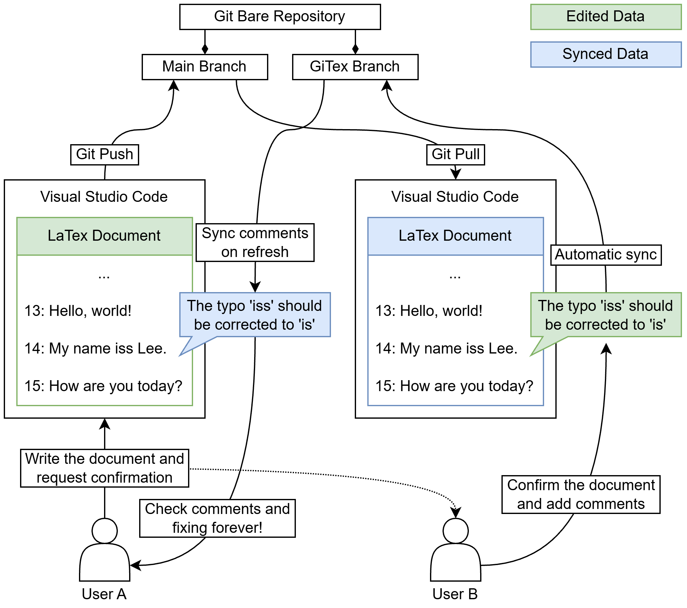

# GiTex

English | [한국어](README.kr.md)

A VS Code extension for sharing passage comments on LaTeX papers through Git. Use it alongside your existing editing, compilation, and PDF preview setup, including LaTeX Workshop.

## Features

- Open or clone a Git repository, or apply one directly to the current folder when no existing paths conflict.
- Discover repositories recursively under workspace folders and switch comments and sync targets with the selected source file.
- Select or add a remote for sharing comments.
- Comment on exactly selected text, or the current line when nothing is selected, in `.tex`, `.bib`, `.sty`, `.cls`, and `.ltx` files.
- Reply to comments and resolve or reopen threads with checkboxes in Explorer and the review panel. Resolved threads stay in Explorer and are hidden in the paper editor.
- Edit comments and replies while preserving the original text and every edit in history.
- Automatically pull and push comments once after creating a comment, replying, or saving an edit; enabled by default and configurable.
- Browse threads in **GiTex Comments** in the Explorer and VS Code's **Comments** panel.
- Follow exact ranges through editor insertions, deletions, same-file cut and paste, and undo/redo.
- Keep the original selection when a target splits; show the comment on the leading surviving fragment.
- Manually move a thread to selected source text, including another file in the same repository, with a complete move history.
- Reuse one review tab when switching threads, preserving unsaved edits and replies while the tab stays open.
- Retain live cuts as **Uncertain**; finalize wholly removed, saved targets as **Outdated** when their editing session ends.
- Shade original comment fragments in pale yellow and inserted text in pale blue; click either shade to open the comment.
- Keep comments **Pending document** when reviews arrive before the paper, and prompt the user to pull the source.
- Save comments offline and synchronize reviews from multiple users through a central bare repository.

Use VS Code's **Source Control** for paper commits, push/pull, and merges. **Sync Comments** and automatic sync after saving both receive and publish review data. They leave your working files, current branch, and staging area unchanged.

## Architecture and collaboration flow

Each collaborator edits a local working copy in VS Code. A shared Git remote stores both the paper and its review history, with separate branches for each. The diagram shows User A writing the paper and User B reviewing it; both users can perform either role.



Green boxes (**Edited Data**) identify data edited by the depicted user. Blue boxes (**Synced Data**) identify data received through Git from the other collaborator.

| Diagram component | Role in GiTex |
| --- | --- |
| **Git Bare Repository** | The shared remote, hosted as a bare repository or on a Git hosting service such as GitHub. Each user has a local working copy. |
| **Main Branch** | The paper's regular branch, such as `main`, containing LaTeX sources, bibliography files, and figures. Paper commits, pulls, pushes, and merges use ordinary Git or VS Code Source Control. |
| **GiTex Branch** | The reserved remote branch `gitex-comments` (`refs/heads/gitex-comments`). It stores immutable events for comments, replies, edits, location changes, and resolved states, plus deduplicated annotated-document snapshots. Local review history lives in `refs/gitex/comments`. |

The collaboration cycle in the diagram works as follows:

1. **Write and share the paper.** User A edits the LaTeX document locally, commits it, and pushes the paper branch.
2. **Review the shared text.** User B pulls the paper changes and adds a GiTex comment to the relevant passage, such as the typo on line 14.
3. **Share review events.** Saving the comment first records it locally. With automatic sync enabled, GiTex then fetches and combines remote review events and pushes the combined history to `gitex-comments` in the background.
4. **Revise and repeat.** User A uses the **Sync Comments** button in Explorer's **GiTex Comments** view to receive shared reviews, checks the anchored passages, and revises the paper. Replies, edits, and resolved states remain in review history while paper revisions continue through the regular branch.

The diagram's **“Sync comments on refresh”** means that a user explicitly refreshes shared reviews from the **GiTex Comments** view in Explorer. Its **Sync Comments** toolbar button receives remote reviews and publishes local review events. The separate **Refresh Comments** button reloads local data; **Fetch Comments** is also available as a command to receive remote reviews without publishing.

Automatic sync runs once after saving a comment, reply, edit, or manual location move. See [Automatic sync after saving](#automatic-sync-after-saving) for the setting and exact triggers. The dotted review-request arrow represents coordination between collaborators, rather than a built-in notification or approval service.

## Installation and usage

You need VS Code 1.90 or later, Git, and a local paper repository. Compiling LaTeX also requires your usual LaTeX extension and TeX distribution.

1. Run **Extensions: Install from VSIX…** from the VS Code Command Palette and select `gitex-0.13.0.vsix`.
2. Open your local paper repository or a parent folder containing several repositories, then select a paper file. To clone a repository, run **GiTex: Clone Repository**. To use the folder already open in VS Code, run **GiTex: Apply Repository to Current Folder**.
3. Configure your Git author name and email if you have not already done so:

   ```sh
   git config user.name "Your Name"
   git config user.email "you@example.com"
   ```

4. GiTex uses `origin` by default. Run **GiTex: Connect Repository** to choose another remote or add one.
5. Drag to select the target text in a paper file and press **Ctrl+Shift+/** (**Cmd+Shift+/** on macOS) to enter a comment. With no selection, the comment applies to the entire current line. You can also use **GiTex: Add Comment** in the editor context menu or the comment button in the editor gutter. Empty or whitespace-only lines have no new-comment gutter button, and an entirely blank selection is rejected before the input opens. A whitespace-only selection inside a nonblank line is also rejected.
6. Saving a comment, reply, or edit automatically syncs reviews in the background. Use **GiTex: Fetch Comments** to receive reviews without publishing, or **GiTex: Sync Comments** to receive and publish manually.
7. Commit and synchronize changes to the paper itself through Source Control.

Expanded inline threads also have a **Sync** button beside **Reply**. It performs the same pull + push as Explorer's **Sync Comments**, synchronizing all saved review events in that thread's repository, even when automatic sync is disabled. To protect unsent replies, this button is enabled only while the reply field is empty; you can use Explorer's **Sync Comments** while drafting a reply.

You can comment on unsaved edits as long as the file already exists on disk. The exact selected text is saved, including partial first and last lines. If a collaborator has not received the annotated document version, the thread stays **Pending document** outside their editor until they pull the paper.

The shortcut applies when the text editor has focus in an editable local `.tex`, `.bib`, `.sty`, `.cls`, or `.ltx` file. To customize it, search for `GiTex: Add Comment` in VS Code's Keyboard Shortcuts.

Network authentication uses Git's SSH agent or HTTPS credential helper. Check that `git ls-remote origin` succeeds in a terminal in the same environment. You need permission to read and write the remote `gitex-comments` branch.

## Selecting a repository by file

GiTex searches every local workspace folder recursively, including nested repositories. The workspace folder itself does not need to be a Git repository. For example, opening `papers/` is enough to work with both `papers/project-a/main.tex` and `papers/group/project-b/main.tex`; select a file to use its repository. The nearest enclosing Git working tree wins, so a submodule or nested repository keeps its own review data. Worktrees with a `.git` file are also recognized.

**GiTex Comments** lists all threads in the selected file's repository, including resolved and pending threads. Its heading identifies the repository. Inline comments, the status count, **Connect Repository**, **Fetch Comments**, and **Sync Comments** follow the same selection. Selecting a file outside a workspace Git working tree clears the comment list. Moving focus into Explorer or the review tab retains the source selection; opening GiTex history retains the corresponding repository.

The existing review tab keeps the thread you opened, with its repository shown above the comments. Selecting another thread reuses that tab. Drafts and pending saves stay bound to their original repository when you switch files, and switching alone never fetches or pushes comments. Settings such as `gitex.remote` and `gitex.autoSyncOnSave` are inherited from the containing workspace folder; nested repositories in that folder share those settings.

Discovery skips Git internals, bare repository storage, temporary GiTex imports, and directory symlinks. It does not stop at the first repository. Opening a repository subfolder still recognizes its enclosing repository without scanning outside the opened folder. Scans are cached during editing; file switches check ownership with Git, and workspace or `.git` changes trigger another scan. Use **GiTex: Refresh Comments** to rescan manually if an external clone or removal is missed by filesystem notifications.

## Editing comments and viewing history

Use **Edit Comment** on an inline comment or reply, change its text, then select **Save Edit**. **Cancel Edit** discards the draft. The thread displays the latest saved text with an **Edited** label. **View Edit History** opens a read-only document containing the original text, every revision, and the editor and timestamp for each version.

If an inline save fails, GiTex opens the review panel with your unsaved draft so you can recover it even though VS Code has closed the inline input.

Click a thread in **GiTex Comments**, or choose **Open GiTex Review** from an inline thread, to open the review panel. Selecting another thread replaces the content of the same tab; switching back restores its unsaved edit/reply drafts and expanded sections while the tab remains open. It supports editing, replies, and expandable **History** sections. **Open source** returns to the associated passage; **Open saved excerpt** opens the saved text while the document is pending. Comment deletion is not provided.

Edits are saved locally as new immutable events, then automatically synchronized when enabled. **Sync Comments** is also available manually. If a remote change arrives while you are editing, your draft stays intact. Saving against an outdated version is rejected: review the history, then cancel and edit the latest version. Concurrent edits created offline are both retained in history; logical clock and event ID determine which version is displayed. Existing comments remain readable in 0.12.0. Upgrade all collaborators to GiTex 0.12.0 before sharing new document snapshots.

## Review panel layout

The review panel follows VS Code's light, dark, and high-contrast themes and adapts to narrow editor splits. The top card shows the repository, source path, current line range, and attachment status. **Saved reference** expands the current shared target and **Original selection** preserves its initial extent; it is a saved snapshot, so it may differ from a passage matched after recent edits. Source navigation, manual movement, and the **Resolved** checkbox sit together beneath it.

Each comment shows its author, timestamp, and edited marker. Edit history and tracking history open on demand, with the newest entries first and the current version marked. On wider panels, manual moves show the previous and new references side by side. Switching threads preserves drafts, expanded sections, and scroll position while the tab stays open.

Use **Ctrl+Enter** (**Cmd+Enter** on macOS) inside a reply or edit field to save, or use its save button. Empty replies are disabled; **Saving…** prevents duplicate submissions while the local save is pending. The sync indicator distinguishes automatic sync on save, manual sync, and sync failures. Expand it for details. Opening or expanding these controls does not access the remote.

## Resolve and reopen

Check **Resolved** in the review panel, or the checkbox beside a thread in **GiTex Comments**, to hide that thread from the LaTeX editor. It remains in Explorer with its history and can still be reviewed. Uncheck it to show the editor comment again when its passage can be located. Inline **Resolve Thread** and **Reopen Thread** commands use the same state.

Resolving a thread with an unsaved inline edit keeps the draft recoverable in the review panel. The old `gitex.showResolved` setting is deprecated and no longer filters either view: resolved threads always stay in Explorer and never show inline. A resolve/reopen change is saved locally and shared on the next comment save or manual **Sync Comments**, preserving the save-only automatic-sync rule.

## Tracking through editor edits

GiTex 0.13.0 follows ranges through VS Code's edit events. Text inserted before a selection shifts its endpoints; text appended at its end stays outside the comment. A same-file cut followed by an exact paste moves the range to the pasted position. Copies do not move attached comments. Undo and redo restore previous ranges.

A line break or whitespace inserted inside the target keeps one multi-line range. Other inserted text splits it: GiTex shows the comment on the leading surviving fragment while retaining the complete **Original selection** and the other fragments. Replies and edits can publish the current reference without replacing that original identity. Only an explicit manual move establishes a new identity; previous identities remain in **Tracking history**.

When the entire target is deleted, an **Uncertain** marker retains its edit position for the current editing session. Saving does not expire the cut: pasting in the same session moves the comment. If the target is still absent from the saved source when its last text tab closes, or when VS Code restarts, the comment becomes **Outdated** and remains only in Explorer and Review. When reviews arrive ahead of the paper, **Pending document** appears in Explorer and Review and the thread is hidden from the editor. Pull the paper through Source Control; **Sync Comments** only receives and publishes reviews. GiTex checks the exact current document or the paper branch's history before replaying changes from a newly received reference.

Comment metadata now includes a deduplicated snapshot of the whole annotated source document, including unsaved source edits. These snapshots establish document versions across clients. Existing events remain readable, but all collaborators must use **GiTex 0.12.0 or later** once the metadata archive uses format 2. Older comments without a recoverable source snapshot may require **Move to editor selection**.

Saved local ranges survive restarting VS Code. File reloads and changes made while closed use an exact edit diff from a known snapshot, without fuzzy sentence matching. Clipboard pairing uses matching deletions in the same document and editing session; cross-file relocation uses the manual move command. See [Anchor tracking design and implementation](docs/anchor-tracking.md) for range rules, snapshot storage, pending states, compatibility, and limits.

## Source highlighting

Unresolved comment fragments stay shaded in pale yellow, including when the inline thread is collapsed. Text inserted between split fragments is pale blue with a dashed outline. Every surviving fragment is shaded; the comment's original selection remains available in Review. Clicking either color opens the comment without taking focus away from the source editor. Dragging a selection or moving the cursor with the keyboard does not open it. Hover text also identifies the region and provides an **Open comment** link.

Resolved, pending, and outdated threads have no source shading. Colors adapt to light, dark, and high-contrast themes. To customize them, use `gitex.commentBackground`, `gitex.commentBorder`, `gitex.insertedBackground`, and `gitex.insertedBorder` under VS Code's `workbench.colorCustomizations`. Use GiTex 0.13.0 across collaborators to preserve inserted-region colors when saving references.

## Move a comment manually

1. Select the destination lines in a visible `.tex`, `.bib`, `.sty`, `.cls`, or `.ltx` editor. With no selection, GiTex uses the cursor line. The file must exist on disk; unsaved edits in it are supported.
2. Open the thread in **GiTex Comments**, then click **Move to editor selection** in the review panel. You can also select **GiTex: Move Comment to Selection** from the thread's Explorer context menu or inline thread toolbar.
3. Alternatively, run **GiTex: Move Comment to Selection** from the Command Palette or the editor context menu and choose the thread to move.

The entire thread, including its replies, moves to the chosen range. You can reattach **Uncertain**, **Outdated**, or **Pending document** threads or move between source files in the same repository. Its ID, comment text, edit history, and resolved state stay intact. Resolved threads remain hidden in the paper editor after moving. Save or cancel an inline comment edit before moving; review-panel drafts are retained.

Every successful move is a separate immutable event, including repeated moves to the same destination. **Tracking history** labels it **Manual move** and shows the previous tracking reference and new file, line range, source text, author, and timestamp. The new location becomes the matching reference for subsequent automatic tracking. Location moves are comment edits for synchronization purposes: they trigger one background pull + push when `gitex.autoSyncOnSave` is enabled, and remain local when disabled.

If the destination text or known comment location changes during selection, the move is rejected so you can select it again. Concurrent offline moves retain both before/after records and choose a current location deterministically. Automatic tracking snapshots from a previous manual location are kept in history without moving the comment back. **Current reference** identifies the active location, which can differ from the final history entry.

All collaborators must use **GiTex 0.12.0 or later** to share moves with document snapshots. Existing comment text and tracking history are preserved.

## Automatic sync after saving

`gitex.autoSyncOnSave` defaults to `true`. A successful new comment, reply, edit, or manual location move triggers one background **pull + push** of review data, after the local save is displayed. Opening, clicking, expanding, focusing, viewing history, starting or canceling an edit, and resolving/reopening a thread do not trigger network requests. **Refresh Comments** only reloads local data. There is no polling.

A sync also publishes previously saved local review events, including resolve/reopen changes. The paper branch, working files, and staging area are unaffected. Concurrent remote edits remain in history; an outdated draft is rejected if a newer revision has already been received locally. Otherwise, edits made before receiving a remote revision are combined as concurrent edits during sync.

If the network fails, the comment stays saved locally. The review panel and status bar indicate pending synchronization, and GiTex Output records the error. The next successful save or **Sync Comments** can retry.

Disable automatic sync in **GiTex: Auto Sync On Save**, or add:

```json
{
  "gitex.autoSyncOnSave": false
}
```

**GiTex: Fetch Comments** and **GiTex: Sync Comments** remain available regardless of this setting. The old `gitex.autoPullOnInteraction` setting is deprecated: interactions never fetch now. An explicit old `false` value keeps automatic sync disabled until you explicitly set `gitex.autoSyncOnSave`.

## Apply a repository to the current folder

Open the destination folder, then run **GiTex: Apply Repository to Current Folder** and enter an SSH/HTTPS URL or local bare repository path. In a multi-folder workspace, GiTex uses the active editor's folder or asks you to select one. Relative local paths are resolved from that folder.

GiTex creates `.git` directly in the folder, checks out the remote default branch's latest fetched commit, and configures `origin` and branch tracking. It does not create an extra project subfolder. Afterwards, use Source Control for paper changes and **Fetch Comments** to receive existing reviews.

The remote is checked in a temporary checkout before applying it. Unrelated existing files are retained as local files; shared directories are allowed when their contents do not overlap. Any existing file at an incoming path blocks the operation, even if its contents match. File/directory conflicts, symlink ancestors, an existing `.git`, a folder inside another Git repository, or unsaved editor files also block it. Save or move conflicting content first; this command never merges or overwrites it.

This command currently requires a default paper branch with a commit and regular files. For repositories with symlinks or submodules, use **Clone Repository**. Import requires a filesystem supporting hard links; exclusive file creation prevents overwriting a file created during import. Failed application rolls back its additions while retaining files changed concurrently by the user.

## Try it with two users

Run this example in a new local directory:

```sh
git init --bare --initial-branch=main paper.git
git clone paper.git alice
cd alice
git config user.name Alice
git config user.email alice@example.test
printf '\\documentclass{article}\n\\begin{document}\nHello, GiTex.\n\\end{document}\n' > main.tex
git add main.tex
git commit -m "Initial paper"
git push -u origin main
cd ..
git clone paper.git bob
git -C bob config user.name Bob
git -C bob config user.email bob@example.test
```

Open `alice` and `bob` in separate VS Code windows with GiTex installed. Alice creates a comment and runs Sync Comments. Bob runs Sync Comments to see it. Replies written offline by both users are preserved when they synchronize. For remote use, expose `paper.git` through SSH or another Git transport.

## Storage and concurrent updates

| Location | Purpose |
| --- | --- |
| Regular paper branches | Paper files such as `.tex`, `.bib`, and figures |
| Local `refs/gitex/comments` | Local review history, including comments not yet shared |
| Remote `refs/heads/gitex-comments` | Shared review history; reserved for GiTex |

Thread creation, replies, edits, manual moves, and state changes are immutable events with UUIDs. Synchronization combines local and remote events, then performs a normal push. If another user publishes first, GiTex fetches, combines the events, and retries without force pushing. Updates from multiple windows sharing a local repository check the previous Git ref value to prevent overwriting one another.

Concurrent resolve and reopen events are ordered by logical clock and event ID to produce a consistent final state. Both events remain in the history. Author information comes from Git configuration; GiTex does not provide separate user authentication or signature verification.

Each reference records the base commit, document hash, file path, source lines, logical columns, and selected text. Editor tracking also stores surviving fragment offsets and a whole-document snapshot at `documents/<documentHash>.txt`. Snapshots are shared across references with identical content. The archive marker is version 2 when snapshots are present; review events retain version 1. Old archives remain readable.

Review history includes annotated document snapshots and author email addresses. A comment on unsaved source text shares that document version when comments synchronize. Backing up only paper branches does not include unpublished local reviews: sync them or back up the entire Git repository. Do not merge `gitex-comments` into a paper branch or use it as an editing branch.

## Development and verification

Use Node.js 22 or later and npm. The Makefile commands below also require GNU Make. The extension has no runtime npm dependencies.

```sh
make install
make package
```

Run these commands from the project root to generate a VSIX for the current version, such as `gitex-0.13.0.vsix`. Run `make` or `make help` to list the available targets.

| Make command | Action |
| --- | --- |
| `make install` | Install development dependencies with `npm ci`; run on initial setup and after dependency changes |
| `make build` | Compile TypeScript with `npm run compile` |
| `make watch` | Recompile on file changes with `npm run watch`; stop with Ctrl+C |
| `make test` | Compile and run core tests with `npm test` |
| `make test-extension` | Run tests in VS Code with `npm run test:extension` |
| `make package` | Compile and create a VSIX with `npm run package` |
| `make clean` | Remove `out/` and root-level `gitex-*.vsix` files; retain dependencies and the VS Code test cache |

Make delegates to the existing npm scripts. You can run the npm commands in the table directly if Make is unavailable.

Open this project in VS Code and press **F5 → Run GiTex Extension** to launch a separate Extension Development Host. Open your paper repository in that window.

```sh
make test
make test-extension
```

`make test-extension` uses the official test tools to download VS Code 1.90.2 and run the extension with a temporary repository and profile. On Linux CI, provide an X server or use `xvfb-run -a make test-extension`. Use `GITEX_VSCODE_VERSION=stable make test-extension` to run against the current stable release. `make package` downloads the official `vsce` tool and produces a VSIX; it does not publish to the Marketplace.

Core tests cover concurrent pushes and edits, complete edit history, outdated drafts, pull without publishing, local updates from multiple windows, offline persistence, server rejection, metadata branch collisions, working tree and index preservation, and moved, edited, rewrapped, deleted, or repeated passages, plus concurrent tracking-reference updates and manual moves with complete before/after history. Extension host tests also use Playwright against the test instance's local debugging port to verify actual review-panel clicks, expansion, editing, resolved visibility, replacement of the shared review tab, draft preservation, editor-operation range tracking, exact gutter selections, cut/paste, undo/redo, split identities, pending documents and recovery after a paper pull, manual cross-file relocation, save-only automatic pull/push, disabled settings, and unsaved-file protection during repository import. Repository tests cover path conflicts, concurrent file creation, rollback, and preserving unrelated files.

Discovery tests cover deep and nested repositories, overlapping workspace folders, worktree/submodule `.git` files, and skipped metadata, bare storage, temporary imports, and symlink cycles. Extension tests verify automatic switching from the active editor, repository-specific sync, retained drafts, and detection after repository creation/removal.

## Current scope

- Reviews sync automatically after saving by default, or through manual commands. Live collaborative typing and automatic server notifications are not implemented.
- Comments appear on LaTeX source. PDF annotations, semantic sentence analysis, and LaTeX compilation checks are not implemented.
- Renamed files are not migrated automatically; use Move Comment to Selection to reattach their threads. Cross-file cut/paste and edits without a recoverable document version require manual reconnection.
- Comment deletion and fine-grained permissions are not implemented. Users with repository write access can share edits, replies, and thread state changes. Original authorship and the editor of each revision are recorded separately.
- Multiple workspace folders, recursively discovered nested repositories, worktrees, and submodules are supported. The selected file chooses the repository; bare storage has no editable working tree.
- This prototype combines events in memory and caps the combined output of each Git command at 32 MiB. Large-history optimization is future work.
- Paper merges use existing Git features. Server-side merge approval and execution are not implemented.

Underlying APIs: [VS Code Comments API](https://code.visualstudio.com/api/references/vscode-api#CommentController), [Git update-ref](https://git-scm.com/docs/git-update-ref), [VSIX packaging](https://code.visualstudio.com/api/working-with-extensions/publishing-extension).
