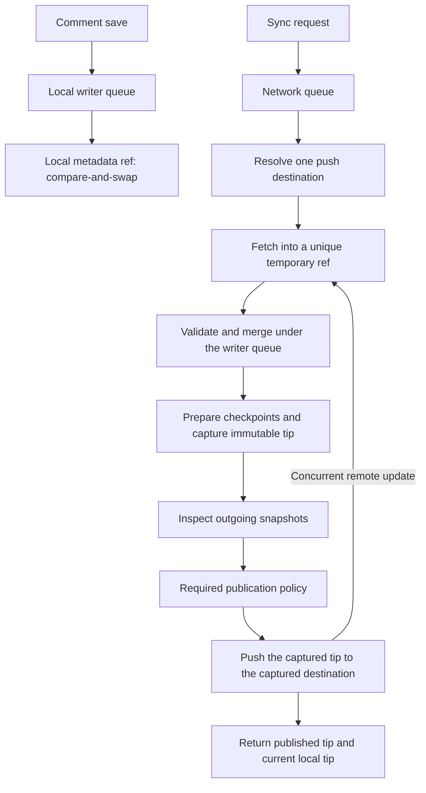

# Architecture review: transaction and publication boundaries

GiTex 0.15.2 retains the commit-scoped review model and archive format 4. This review concentrates on ownership and concurrency: a local save, a received archive and an approved publication have different completion boundaries.

## Product collaboration boundary

GiTex supports asynchronous review with one active source author and multiple concurrent reviewers. Participants serialize paper editing and hand off authorship through Git commits and synchronization, while independent comments and replies can be written in parallel. This is a workflow agreement, not a source-editing lock.

Participants collect the previous paper version's reviews before the next version's first review publication freezes inheritance. No clean-commit rule is introduced: uncommitted-source comments may remain pending for recipients who lack the referenced document version. The [supported collaboration model](collaboration-model.md) describes the review round and distinguishes metadata publication from source push.

Stabilizing this bounded workflow takes priority over introducing real-time document editing or global coordination protocols. Existing merge-commit handling and immutable-event merging remain useful mechanisms within that scope.

## State ownership

| Owner | Authority | Lifetime |
| --- | --- | --- |
| Editor tracking | Observed changes, surviving fragments, insertion ranges, live cut tickets | Editing session; validated local geometry can be restored |
| Paper Git history | Source commit identity and committed document bytes | Ordinary source repository history |
| Review model and archive | Immutable events, original selection, version-specific discussion and checkpoints | Local metadata ref and shared metadata branch |
| Review store | Local transactions, archive validation, semantic union and publication preparation | Store instance; compare-and-swap protects other instances |
| Review transport | Resolved destination, received immutable tip, normal Git push | One network operation |
| Extension publication policy | Disclosure and permission to share the inspected snapshot batch | Repository/destination acknowledgment plus per-batch checks |
| Extension UI | Current paper-version projection and sync feedback | Derived view; not another review record |

Editor state cannot establish a paper commit. Receiving metadata cannot establish receipt of the paper source. Successful local storage cannot establish successful remote publication. These distinctions remain explicit; there is no new persistent synchronization state machine or archive migration in this update.

## Local storage must not wait for the network

Previously, one promise queue serialized local writes together with fetch, approval and push. A slow remote or an unanswered disclosure could therefore block the next comment save. Using another store instance concealed this problem in some concurrency tests.

The store now owns two queues. The local writer queue serializes archive changes. The network queue serializes pull/sync operations for that store. Fetch and publication approval execute outside the writer queue. Receiving an archive enters a local transaction only to validate and union its immutable contents; publication preparation briefly enters that queue to create checkpoints and capture a tip.

Only the network path acquires the local writer queue. Local write operations do not acquire the network queue, and publication callbacks run with neither a local write transaction nor a writer lock held. The callback must not await another network operation on the same store, since network operations are intentionally serialized. A second window can still change the local ref; compare-and-swap retries preserve its events.

This is not a guarantee that every save completes immediately: local Git I/O, archive validation and checkpoint computation still take time. It removes dependence on remote latency and user response time.

## A publication names both content and destination

Sync resolves the remote's push URL once and receives existing comments from that same endpoint. Ordinary Fetch Comments uses the fetch URL. This matters for Git configurations with separate fetch and push servers: receiving server A and trying to merge into server B does not establish B's review state.

Each receive holds a unique `refs/gitex/transfers/<uuid>` ref until validation and local merge finish, then removes it in a `finally` block. Concurrent store instances do not overwrite a shared transport ref. A process crash can leave a harmless private ref; it does not change paper HEAD, the index or the shared branch. Multiple push URLs remain unsupported; use separate remotes for separate destinations.

The store refuses to sync without an explicit publication policy before network access or checkpoint mutation. Production supplies snapshot disclosure and sharing checks. Tests use a deliberately explicit policy for temporary local bare repositories. This prevents a newly added extension entry point from accidentally bypassing inspection by omitting a callback; it is not a server authorization mechanism.

After approval, only the inspected immutable tip is pushed. A comment saved while the dialog or push is pending is never substituted into that batch. Changing the remote alias during approval does not redirect the already resolved destination. A rejected concurrent push receives the latest remote archive, unions events, prepares and inspects the next batch again, up to four attempts. It never force-pushes.

## Completion is a receipt, not a global boolean

Sync returns the published metadata tip and a snapshot of the current local tip and threads. Different tips mean newer local work remains after this publication. The extension shows **Sync pending** with that explanation instead of claiming every local comment was shared. A later automatic save-triggered sync or manual sync publishes the remainder under the same policy.

Fetch is receive-only, so it does not clear an outstanding publication notice. A successful subsequent sync clears that notice when the returned local and published tips match. This receipt describes the observed completion point, not a promise that another window or remote collaborator will never make a later change. No durable receipt file or new review event is required.

## Preserved model and deliberate limits

- Original Selection remains independent of tracked geometry; uncertain reconstruction cannot silently renew it.
- Review display remains scoped to the checked-out paper commit. Updating comments never requires the newest remote paper commit.
- First publication freezes inherited discussion; late ancestor updates are disclosed without automatically merging across paper versions.
- Full source snapshots and immutable review events remain in Git history. Inspection and acknowledgment do not provide retention limits or erase old source.
- Git author email is a collaboration convention, not authenticated identity. Branch permissions and repository access remain Git-host responsibilities.
- Cross-window safety is based on immutable IDs and local ref compare-and-swap. Network queues are per store, not a distributed lock.
- Reconstructed diff agreement and exact cut/paste text remain evidence with documented limits, not proof of user intent.

The next validation priority is two-person use with independent windows, delayed transport, offline work and repeated source-version changes. Further abstractions, new anchor heuristics and automatic cross-version merges should follow demonstrated failures rather than precede that evidence.

## Regression evidence

`test/synchronization.test.ts` tests saves on the **same store** while approval, discovery, fetch or push is held; publication of only the approved tip; missing-policy rejection; separate fetch/push servers; destination changes during approval; and temporary-ref isolation/cleanup on failure. Existing core tests cover remote push races and immutable-event conflicts.

The VS Code Review test also holds a real store's push, saves an inline reply before releasing it, verifies the pending notice and remote absence, fetches without clearing the notice, and publishes the reply on the next sync. See [Stability validation](stability-validation.md) for the full matrix and limits, [Commit-scoped reviews](commit-reviews.md) for inheritance/storage, and [Anchor tracking](anchor-tracking.md) for evidence rules.
