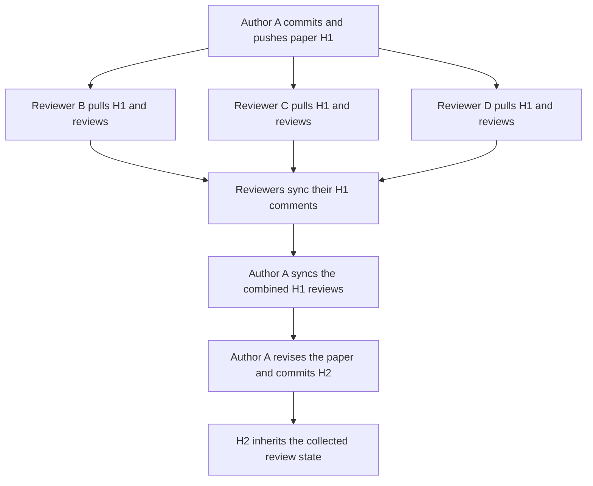

# Supported collaboration model

GiTex is an asynchronous Git review system for **one active paper author and multiple concurrent reviewers**. It fits a paper author collecting feedback from supervisors and coauthors. Source editing is serialized by the participants; comment and reply creation can proceed in parallel.

The active author is a role that can change between participants. This workflow is a collaboration agreement, not an editor lock or a server-enforced permission. GiTex does not provide a real-time shared document editor or coordinate simultaneous source edits across collaborators.

## A review round

1. The author commits a document version **H1** and pushes the paper branch through ordinary Git or Source Control.
2. Reviewers pull and check out H1. They can write independent comments and replies concurrently; they do not need to take turns reviewing.
3. Each reviewer synchronizes saved reviews. GiTex merges independent comment files and immutable event IDs. If another reviewer wins a push race, synchronization fetches, merges and retries within its retry limit. Same-author competing edits retain their revisions and remain visible as conflicts.
4. Before ending the round, participants agree that the H1 reviews intended for the next version have been shared. The author completes **Sync Comments** to collect those reviews and share any local responses. A fetch cannot discover comments still saved only on another participant's machine.
5. The author revises the source and creates **H2**. GiTex creates a review copy for H2, inheriting the applicable H1 review state and tracking locations through the source changes. Subsequent discussion on H1 and H2 belongs to each version separately.

## Two coordination rules

**One source editor at a time.** Only one participant actively changes the paper source during a writing turn. To hand over that role, the outgoing author commits and pushes the source changes and synchronizes reviews; the incoming author pulls the agreed source commit and reviews before editing. The author does not have to be the same person throughout the project, and this rule does not serialize reviewers' comments or replies.

**Collect the previous version's reviews before publishing the next version's reviews for the first time.** H2's first review publication freezes its inherited discussion. A comment or reply that reaches H1 afterward remains available on H1 but does not automatically enter the published H2 copy. Wholly excluded unresolved threads appear as **Earlier unresolved** with their source hash in Explorer, including on later commits. Their Review is read only and they have no inline comments or source decorations. Resolve them on the original commit, or explicitly reconnect them when appropriate. Resolved historical threads remain **Not inherited**; missing ancestor updates to an existing current thread are disclosed as **Earlier updates**.

Here, *publication* means successfully sharing H2's review metadata on `gitex-comments`, not pushing H2's paper branch. `gitex.autoSyncOnCommit` can schedule review publication as soon as a new local source commit is observed. The straightforward workflow is therefore to finish collecting H1 reviews **before creating H2**. Merely delaying the source push is not a way to keep H2's review inheritance open. A later Sync Comments does not reopen inheritance that has already been published.

## Uncommitted source is allowed

GiTex does not require a clean working tree or a source commit before every comment. The author can continue using local edit tracking and reviewing unsaved or uncommitted text. A recipient who has not received the referenced document version may see **Pending document**, with the thread kept outside the source editor until that version is available.

Comment synchronization and source synchronization are separate. Receiving review metadata does not update the recipient's paper checkout, and reviewing H1 does not require pulling the latest remote paper commit. Existing snapshot-sharing acknowledgment and uncommitted-snapshot settings still apply; see [Snapshot sharing and size](commit-reviews.md#snapshot-sharing-and-size).

## Scope and stability priorities

The supported workflow serializes source authorship while allowing parallel review. It relies on ordinary Git source handoff, immutable review-event merging and paper-commit-specific views. It does not add a distributed source-editing protocol, a global reviewer-completion barrier or a clean-commit restriction. Git branch and merge support in the data model does not constitute a guarantee of coordinated simultaneous source editing.

The priority is to stabilize this workflow with multiple reviewers on the same commit, offline reviews, source handoffs and late ancestor updates. Additional consistency algorithms should follow demonstrated failures within that scope. See [Commit-scoped reviews](commit-reviews.md), [Architecture review](architecture-review.md) and [Stability validation](stability-validation.md) for the underlying rules and tested boundaries.
